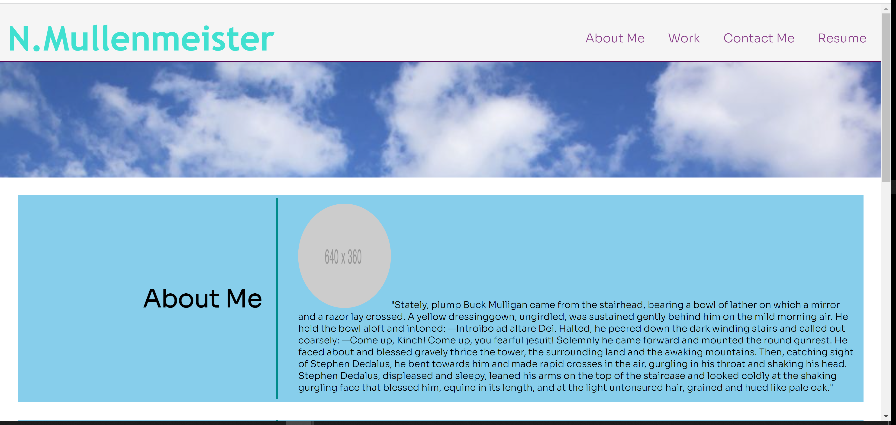
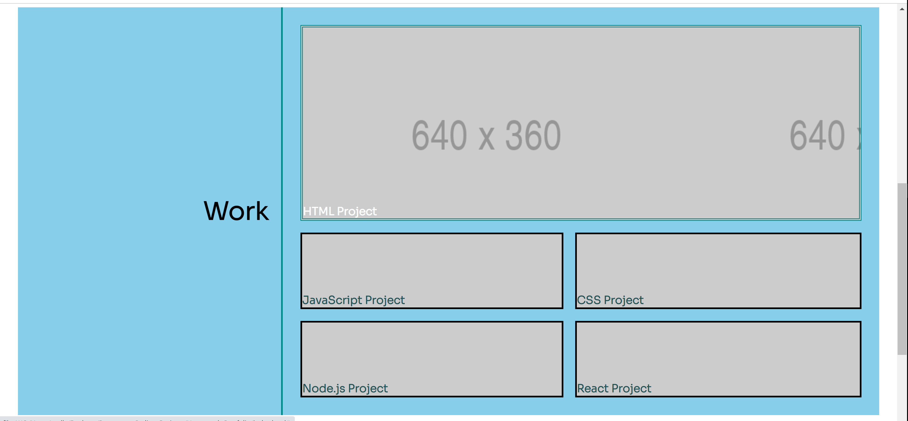
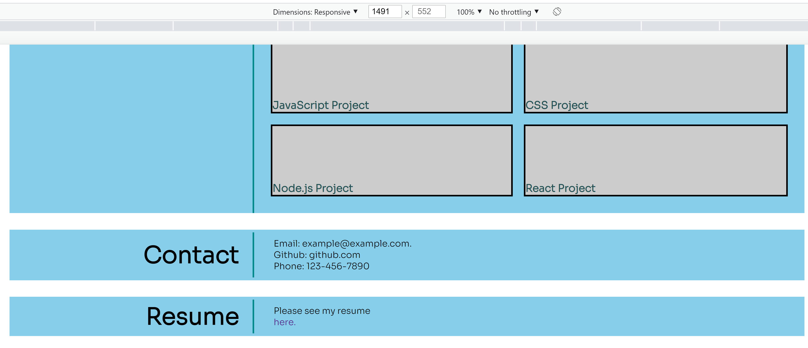
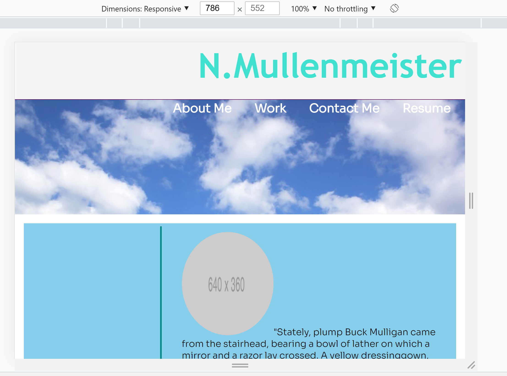
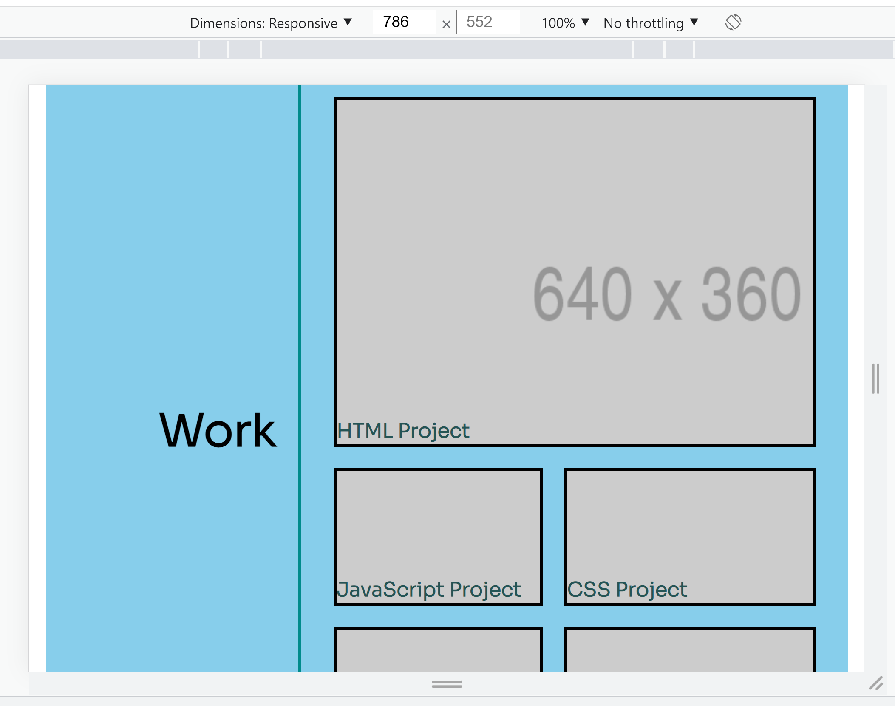
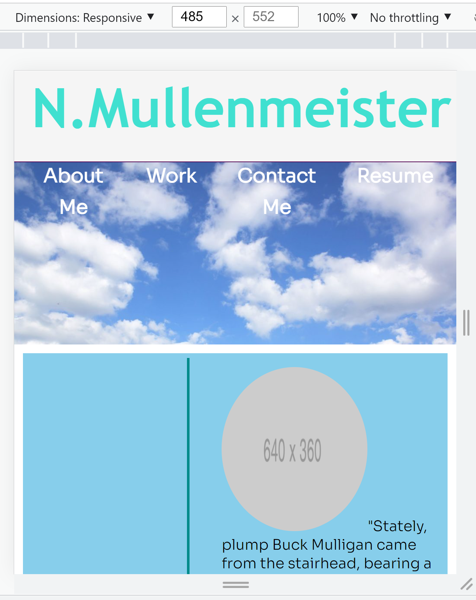
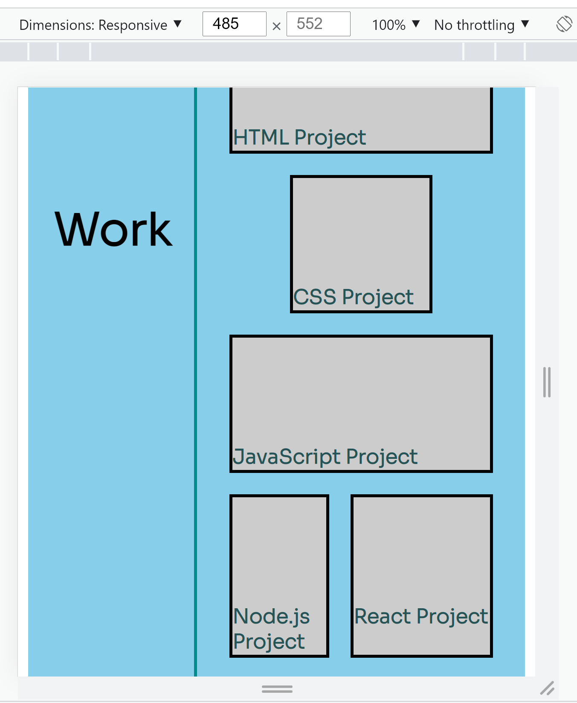

# Homework-Portfolio

Sources:

This is my second homework assignment.
I saved one image from Google images to the directory.
It is labeled "cloud--1024x667.jpg.
I found this image at the following dictionary website URL: http://www.macmillandictionaryblog.com/cloud
The quote in the "About Me" section is taken from the first page of "Ulysses" by James Joyce.

Introduction:

I made this project in order to apply the HTML and advanced CSS we learned. It's my portfolio with four main sections: About Me, Work, Contact Me, and Resume. We can click on the navbar links to reach the corresponding sections of the webpage. We can also click each project image in the work section to be brought to the corresponding project page. The project is compatible with smartphones and tablets of varying sizes. 

General:

Here are some of the tools I used:

Basic HTML and CSS
Flexbox
Media Queries

Screenshots:

Here are different screenshots of different  screen sizes:

Full Screen (Laptop):

Tablet or phone:

Tablet or phone:

You can see my webpage live here: https://mully7773.github.io/Homework-Portfolio/

Built Using:

Visual Studio Code
HTML
CSS
Chrome DevTools

Author:
Nick Mullenmeister